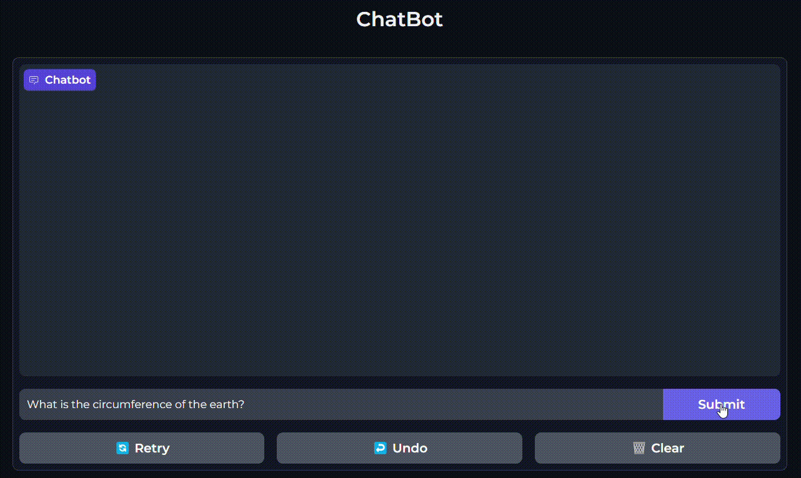

# Chatbot



This is a chatbot application that utilizes OpenAI's API for natural language processing and Gradio for the user interface. The application is containerized using Docker for easy deployment and management of app dependencies.

## App Description

The chatbot app allows users to interact with an AI model powered by OpenAI's API. Users can ask questions or have conversations with the chatbot, which will respond with relevant answers based on the trained model's understanding of the input.

## Prerequisites

Before running or building the chatbot app, ensure that you have an OpenAI API key. You can sign up for an API key at [OpenAI website](https://openai.com).

## Steps to Setup

1. Clone the repository to your local machine:

    ```bash
    git clone https://github.com/your-username/chatbot.git
    ```

2. Create a `.env` file in the cloned repository and include the following line, replacing `<API_KEY>` with your actual OpenAI API key:

    ```bash
     # Set as empty string for local llm otherwise use API key
    API_KEY=<API_KEY>
     # Set for local llm, otherwise remove.
    BASE_URL=http://model-runner.docker.internal:80/engines/llama.cpp/v1
     # Set what model you want to use.
    MODEL=ai/llama3.2:latest
    ```

3. Build and run the containerized app:

    - For development (with docker-compose):

        ```bash
        docker-compose up --build
        ```

    - For deployment (build and run the image):

        ```bash
        docker build -t chatbot .
        docker run -d --name chat_app_cont -p 7860:7860 chatbot
        ```

        The app will be accessible at [http://localhost:7860](http://localhost:7860).

## Troubleshooting

- If the app fails to build or run due to missing dependencies, make sure you have Docker properly installed and running on your machine.
- If you encounter any issues with OpenAI's API, ensure that you have correctly set the `API_KEY` variable in the `.env` file and that it is being read by the app.

## Contributions

Contributions to the chatbot app are welcome. If you find any bugs or have suggestions for improvements, feel free to create a pull request or open an issue on the GitHub repository.

## License

This project is licensed under the [MIT License](LICENSE).